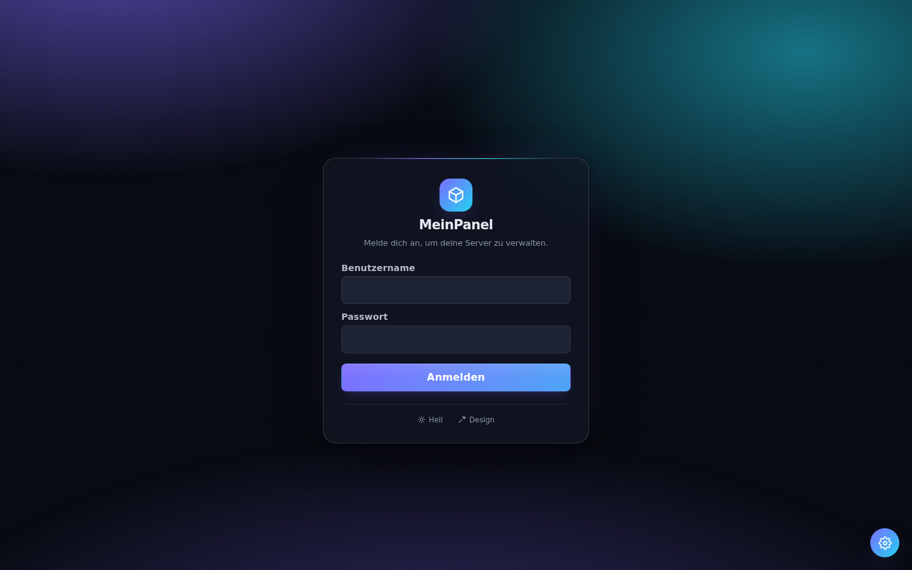
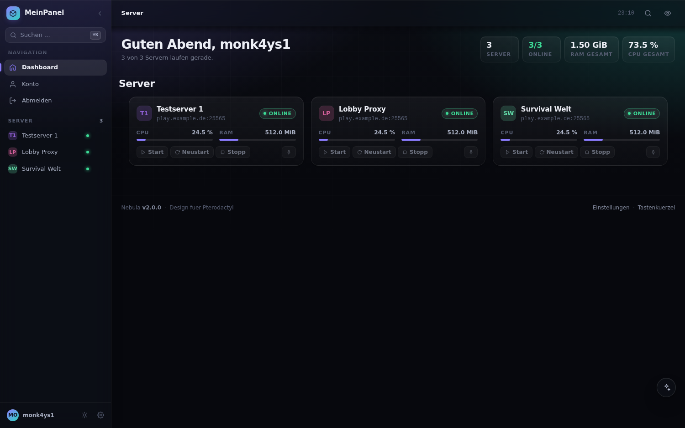
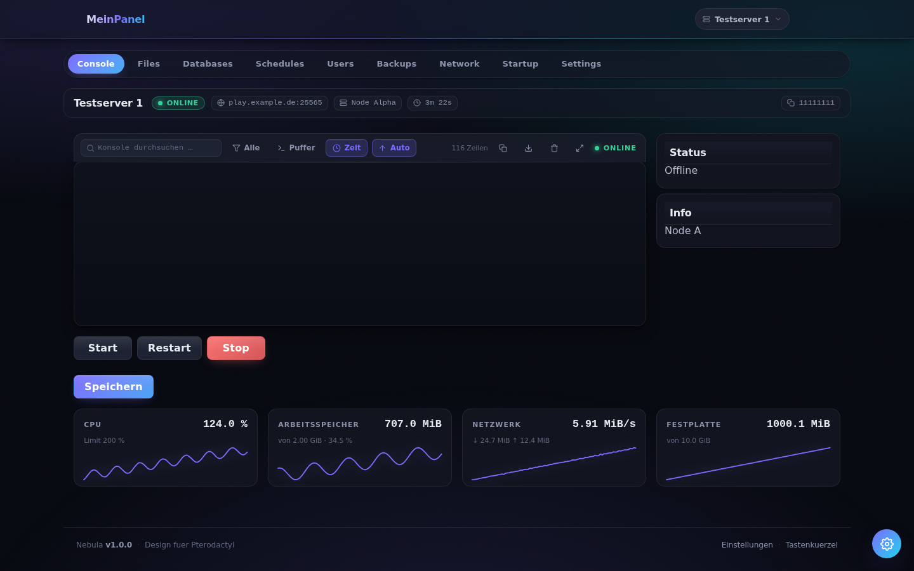
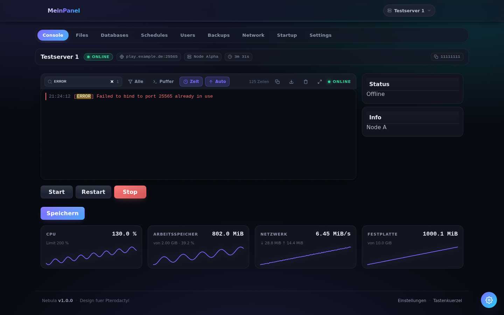
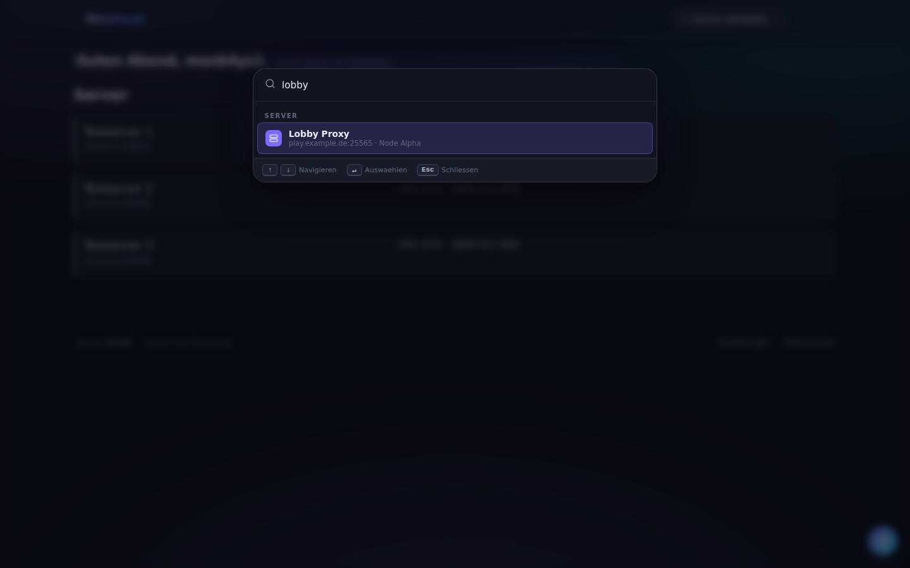
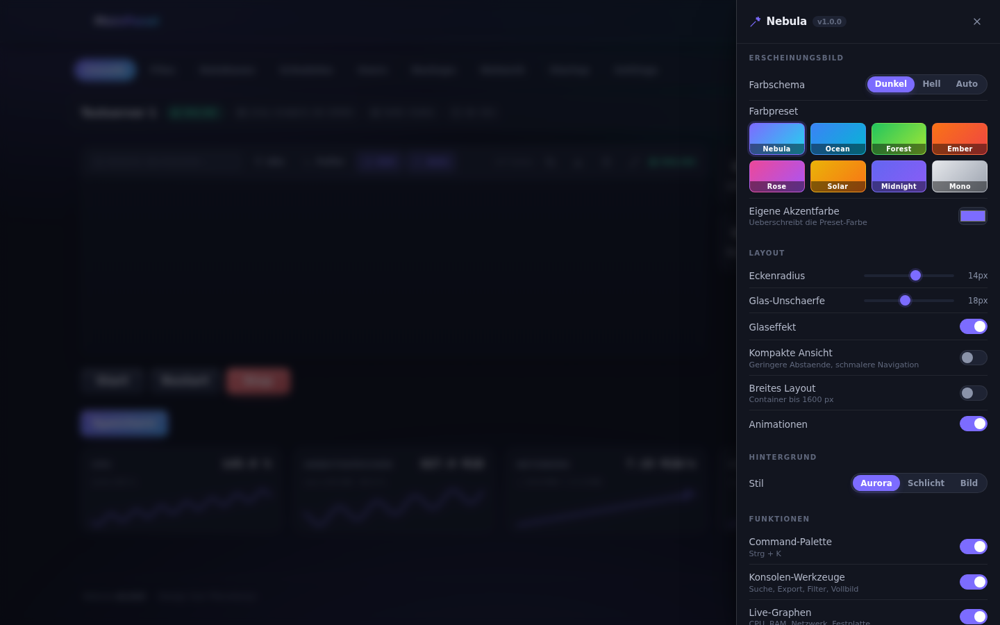
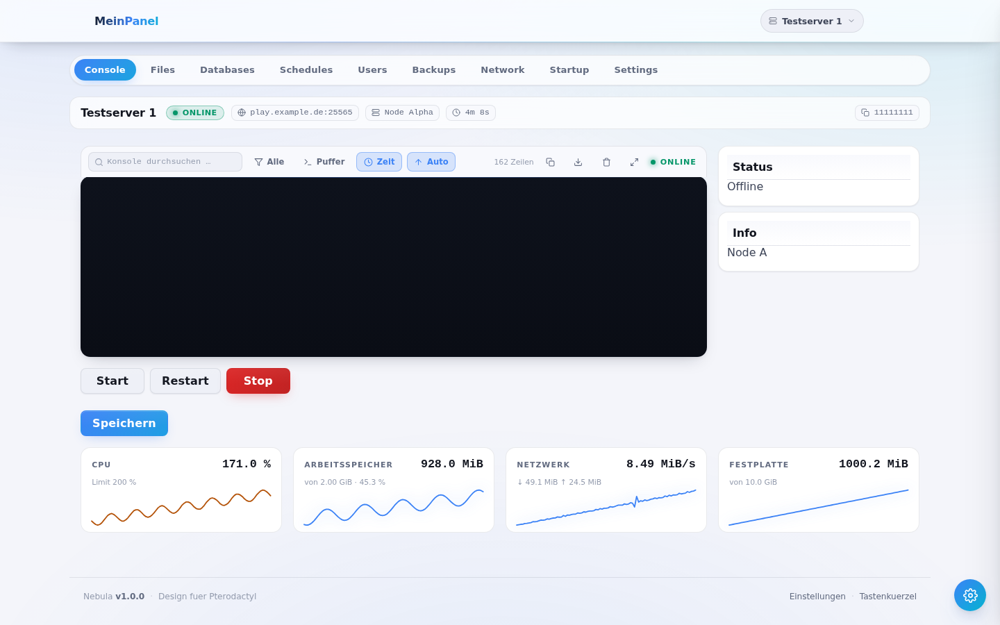
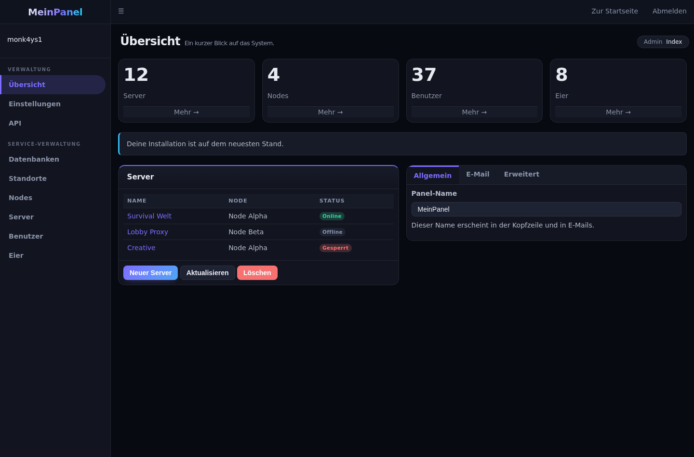

<div align="center">

# Nebula

**Ein komplettes Redesign für das Pterodactyl Panel – mit einem einzigen Befehl installiert.**

Neue Optik für Client- *und* Adminbereich, dazu Command-Palette, Live-Graphen,
Konsolen-Werkzeuge, acht Farbpresets und ein Hellmodus.
Ohne Rebuild des Frontends, jederzeit rückstandslos entfernbar.

</div>

---

## Installation

```bash
bash <(curl -fsSL https://raw.githubusercontent.com/Monk4ys1/pterodactyl-design/HEAD/install.sh)
```

Das war's. Der Installer findet dein Panel selbst, legt vorher ein Backup an und
sagt dir am Ende, was du drücken kannst.

> Falls `curl` fehlt: `apt install curl` bzw. `dnf install curl`.
> Der Befehl muss als `root` laufen (oder mit `sudo bash <(...)`).

> **Solange dieses Repository privat ist**, kann `curl` die Datei nicht ohne
> Zugangsdaten laden. Dann entweder das Repository oeffentlich schalten – danach
> funktioniert der Ein-Zeiler unveraendert – oder einmalig klonen:
>
> ```bash
> git clone https://github.com/Monk4ys1/pterodactyl-design.git
> sudo bash pterodactyl-design/install.sh
> ```
>
> Der Installer erkennt, dass er aus einem lokalen Verzeichnis läuft, und lädt
> dann nichts nach.

Danach im Browser einmal mit <kbd>Strg</kbd>+<kbd>F5</kbd> neu laden.

### Wieder entfernen

```bash
nebula uninstall
```

Das Panel ist danach **byte-identisch** im Originalzustand – die Blade-Templates
werden exakt so wiederhergestellt, wie sie vorher waren.

---

## Screenshots

| Anmeldung | Übersicht |
|---|---|
|  |  |

| Serverkonsole mit Live-Graphen | Konsolensuche |
|---|---|
|  |  |

| Command-Palette | Einstellungen |
|---|---|
|  |  |

| Hellmodus | Adminbereich |
|---|---|
|  |  |

<sub>Die Bilder stammen aus der automatisierten Testumgebung unter `tests/`, die
das Markup und die Farbwerte des Pterodactyl-Frontends nachbildet.</sub>

---

## Was dazukommt

### Optik

- **Durchgehend neu gestaltet** – Navigation, Sub-Navigation als Pill-Tabs,
  Karten, Tabellen, Formulare, Buttons, Modals, Konsole und Login.
- **Glaseffekt** mit Weichzeichner in Navigation, Toasts und Overlays.
- **Acht Farbpresets** – Nebula, Ocean, Forest, Ember, Rose, Solar, Midnight, Mono.
- **Freie Akzentfarbe** über einen Farbwähler.
- **Hell- / Dunkel- / Automatikmodus** (Automatik folgt dem Betriebssystem).
  Das Terminal bleibt im Hellmodus bewusst dunkel, weil xterm.js seine
  Vordergrundfarben auf ein Canvas zeichnet und sonst unlesbar würde.
- **Adminbereich** ebenfalls komplett überarbeitet – Seitenleiste, Boxen,
  Reiter, Tabellen, Formulare, Select2 und der CodeMirror-Editor.
- **Einstellbar**: Eckenradius, Glasstärke, kompakte Ansicht, breites Layout
  (bis 1600 px), Animationen an/aus, Hintergrund (Aurora / schlicht / eigenes Bild).

### Funktionen

| Funktion | Beschreibung |
|---|---|
| **Command-Palette** | <kbd>Strg</kbd>+<kbd>K</kbd>: Server suchen, Seiten wechseln, Server starten/stoppen, Preset umschalten – alles über eine Fuzzy-Suche. |
| **Live-Graphen** | Verlaufskurven für CPU, Arbeitsspeicher, Netzwerkdurchsatz und Festplatte, farblich gewarnt ab 75 % bzw. 90 % des Limits. |
| **Konsolen-Werkzeuge** | Volltextsuche mit Hervorhebung, Filter nach Fehlern/Warnungen, Zeitstempel, Zeilenzähler, Kopieren, Download als `.log`, Vollbild. |
| **Serverleiste** | Name, Status, Adresse, Node, Laufzeit und UUID – Adresse und UUID per Klick kopierbar. |
| **Statusmeldungen** | Toast bei jedem Statuswechsel, Statuspunkt im Favicon, Symbol im Seitentitel, optional Desktop-Hinweis und Signalton. |
| **Absturzerkennung** | Erkennt Muster wie `exited with code`, `marked as offline` oder `OutOfMemory` im Konsolenstrom und meldet sie. |
| **Tastenkürzel** | Sprungbefehle, Power-Aktionen und Reiterwechsel – Übersicht mit <kbd>Strg</kbd>+<kbd>/</kbd>. |
| **Schnellwechsler** | Knopf in der Navigation, der direkt in die Serversuche springt. |
| **Begrüßung** | Tageszeitabhängige Anrede mit Benutzernamen auf dem Dashboard. |

Jede einzelne Funktion lässt sich im Einstellungs-Drawer (Zahnrad unten rechts)
abschalten – auch das Zahnrad selbst.

### Tastenkürzel

| Kürzel | Aktion |
|---|---|
| <kbd>Strg</kbd>+<kbd>K</kbd> | Command-Palette |
| <kbd>Strg</kbd>+<kbd>/</kbd> | Übersicht der Tastenkürzel |
| <kbd>Strg</kbd>+<kbd>Umschalt</kbd>+<kbd>E</kbd> | Einstellungen |
| <kbd>Strg</kbd>+<kbd>Umschalt</kbd>+<kbd>L</kbd> | Hell / Dunkel |
| <kbd>Strg</kbd>+<kbd>Umschalt</kbd>+<kbd>F</kbd> | Konsole im Vollbild |
| <kbd>g</kbd> dann <kbd>d</kbd>/<kbd>c</kbd>/<kbd>f</kbd>/<kbd>b</kbd>/<kbd>n</kbd>/<kbd>u</kbd>/<kbd>t</kbd>/<kbd>s</kbd>/<kbd>a</kbd> | Dashboard, Konsole, Dateien, Backups, Netzwerk, Benutzer, Zeitpläne, Servereinstellungen, Konto |
| <kbd>Alt</kbd>+<kbd>S</kbd> / <kbd>R</kbd> / <kbd>X</kbd> / <kbd>K</kbd> | Starten, Neustart, Stoppen, Kill |
| <kbd>Alt</kbd>+<kbd>1</kbd> … <kbd>9</kbd> | Reiter der Sub-Navigation |
| <kbd>Esc</kbd> | Oberstes Overlay schließen |

Sprungbefehle und Power-Kürzel greifen nur außerhalb von Eingabefeldern und
außerhalb des Terminals.

---

## Kompatibilität

| | |
|---|---|
| **Panel** | Pterodactyl 1.11.x (getestet gegen 1.11.7 – 1.11.10) und 1.10.x |
| **PHP** | ≥ 8.1 – das Theme selbst führt keinen PHP-Code aus |
| **Browser** | Chrome/Edge 111+, Firefox 113+, Safari 16.4+ (`color-mix()` wird benötigt) |
| **Rebuild** | **nicht nötig** – `yarn build:production` bleibt außen vor |
| **Datenbank** | wird nicht angefasst |

Bei einer unbekannten Panel-Version installiert Nebula trotzdem, warnt aber
vorher. Da alles reversibel ist, kostet ein Versuch nichts.

---

## Befehle

Der Installer legt den Befehl `nebula` an:

```bash
nebula update      # Theme neu bauen und einspielen (auch nach Panel-Updates)
nebula uninstall   # Vollständig entfernen
nebula doctor      # Installation prüfen
nebula status      # Version, Asset-Version, Installationszeitpunkt, Backup
nebula restore     # Letztes Backup zurückspielen
```

Der Installer selbst kennt zusätzlich:

```bash
--path <verzeichnis>   Pfad zum Panel (sonst automatisch erkannt)
--branch <name>        Anderer Git-Branch als Quelle
--yes                  Ohne Rückfragen
--no-backup            Kein Backup (nicht empfohlen)
--no-admin             Adminbereich unverändert lassen
--no-cli               Den Befehl "nebula" nicht anlegen
--dry-run              Nur anzeigen, was passieren würde
```

### Nach einem Panel-Update

Ein Panel-Update überschreibt `resources/views/templates/wrapper.blade.php` und
entfernt damit den Nebula-Block. Einmal

```bash
nebula update
```

und alles ist wieder da. `nebula doctor` weist von sich aus darauf hin, wenn sich
die Panel-Version seit der Installation geändert hat.

---

## Wie es funktioniert

Pterodactyls Client-Oberfläche ist eine React-Anwendung, deren Klassennamen beim
Build gehasht werden. Ein Theme, das sich darauf verlässt, ist beim nächsten
Panel-Update kaputt. Nebula geht deshalb einen anderen Weg:

```
resources/views/templates/wrapper.blade.php   ← ein Block zwischen Markern
resources/views/layouts/admin.blade.php       ← ein Block zwischen Markern
public/themes/nebula/                         ← nebula.css / nebula.js
```

1. **`nebula.js` startet im `<head>`**, also noch vor dem React-Bundle.
2. Ein **DOM-Tagger** (`MutationObserver`) versieht die gerenderten Elemente mit
   stabilen `data-ptd`-Attributen – Navigation, Sub-Navigation, Karten, Konsole,
   Modals, Serverkacheln. Das CSS stylt anschließend diese Attribute statt der
   gehashten Klassen. Button-Varianten werden über die Tailwind-Klasse bzw. den
   Farbton der berechneten Hintergrundfarbe erkannt.
3. Zusätzlich werden die **Tailwind-Farbklassen** von Pterodactyl
   (`bg-neutral-700`, `text-neutral-400`, `bg-primary-500` …) auf
   CSS-Custom-Properties umgebogen. Dadurch färbt sich auch alles um, was der
   Tagger gar nicht kennt.
4. `window.WebSocket` wird **transparent gekapselt**, um den Wings-Datenstrom
   mitzulesen (`console output`, `stats`, `status`). Daraus entstehen Graphen,
   Konsolensuche und Statusmeldungen – **ohne eine einzige zusätzliche Anfrage**
   an Panel oder Node. Die Verbindung selbst wird nicht verändert.
5. Genauso werden die ohnehin laufenden Ressourcen-Abfragen des Dashboards
   mitgehört, um den Kacheln ihre Statusfarbe zu geben.

Alle Einstellungen liegen im `localStorage` des Browsers (`ptd:settings`), sind
also **pro Benutzer** und ändern nichts am Panel.

### Sicherheit und Rücksprung

- Vor jeder Installation wandert alles Betroffene nach
  `/var/backups/nebula/<zeitstempel>.tar.gz` (Modus `600`).
- Der eingefügte Blade-Block steht zwischen `{{-- NEBULA:START --}}` und
  `{{-- NEBULA:END --}}` und wird beim Entfernen sauber herausgeschnitten.
- Dateien werden über `cat tmp > datei` geschrieben, damit Besitzer, Rechte und
  SELinux-Kontext erhalten bleiben.
- Es wird ausschließlich `php artisan view:clear` ausgeführt – nur der
  View-Cache, keine Config- oder Route-Caches.
- Jeder JavaScript-Baustein ist in `try/catch` gekapselt; ein Fehler im Theme
  darf den Panelbetrieb nicht stören.

---

## Entwicklung

```
theme/css/     Quell-Stylesheets (Tokens, Basis, Layout, Komponenten, Konsole, Login, eigene UI, Admin)
theme/js/      Quell-Skripte (Boot, Core, Tagger, Einstellungen, Palette, Konsole, Graphen, Meldungen, Kürzel, Erweiterungen)
theme/blade/   Die eingefügten Blade-Blöcke
scripts/       build.sh – fasst die Quellen zu den Bundles zusammen
tests/         Nachbau der Panel-Oberfläche + Browsertests
install.sh     Installer, Updater, Deinstaller, Diagnose
```

Bundles bauen:

```bash
bash scripts/build.sh dist
```

Ergebnis: `nebula.css`, `nebula.js` (Client) sowie `nebula-admin.css`,
`nebula-admin.js` (Admin) – rund 30 kB JavaScript und 12 kB CSS, gzip-komprimiert.

Testen (startet einen Nachbau der Panel-Oberfläche samt Wings-WebSocket und
prüft ihn in einem echten Chromium):

```bash
bash tests/run.sh
```

Die Suite prüft 44 Punkte – von der Erkennung der Login-Karte über den
WebSocket-Mitschnitt und die Kurvenberechnung bis zur SPA-Navigation – und legt
Screenshots unter `tests/shots/` ab.

Lokal installieren, ohne etwas herunterzuladen:

```bash
sudo bash install.sh --path /var/www/pterodactyl --yes
```

---

## Fehlersuche

**Nach der Installation sieht alles aus wie vorher.**
Browser-Cache leeren (<kbd>Strg</kbd>+<kbd>F5</kbd>). Wenn es bleibt:
`nebula doctor`.

**`nebula doctor` meldet fehlende Assets.**
`nebula update` spielt sie neu ein.

**Das Panel zeigt eine weiße Seite.**
`nebula uninstall` – oder direkt `nebula restore`. Beides stellt den
Ausgangszustand wieder her.

**Die Graphen bleiben leer.**
Sie zeigen nur laufende Server. Ist der Server online und die Konsole verbunden,
füllen sich die Kurven innerhalb weniger Sekunden.

**Die Schriften laden nicht (Panel ohne Internetzugang).**
Im Einstellungs-Drawer unter *Sonstiges* → *Webfonts laden* abschalten. Nebula
fällt dann auf die Systemschriften zurück; das Layout bleibt gleich.

**Der Installer findet das Panel nicht.**
`sudo bash install.sh --path /pfad/zum/panel`.

---

## Lizenz

MIT – siehe [LICENSE](LICENSE).

Nebula ist ein eigenständiges Projekt und steht in keiner Verbindung zum
Pterodactyl-Projekt.
