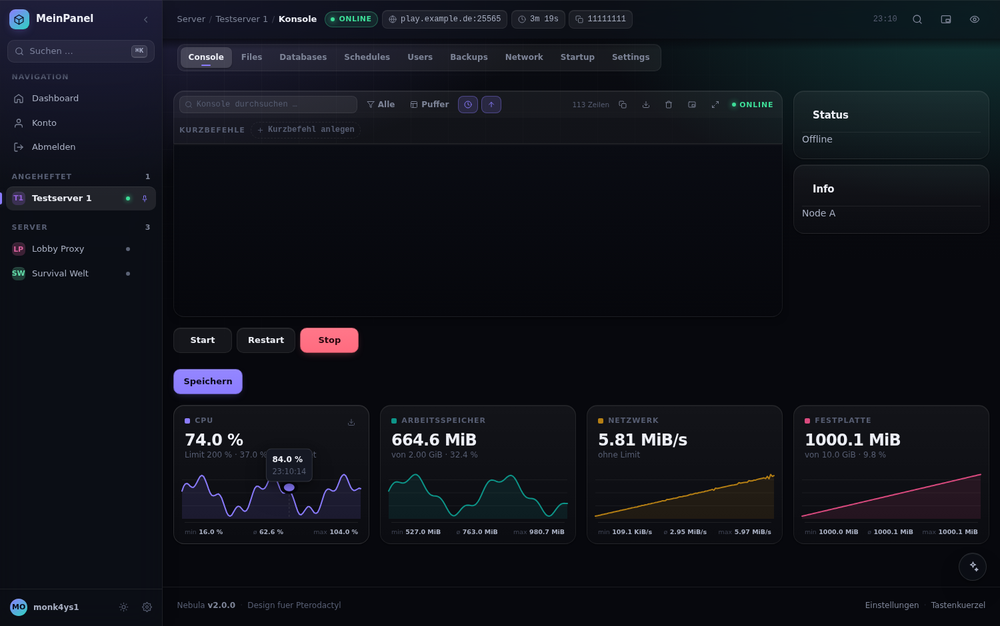
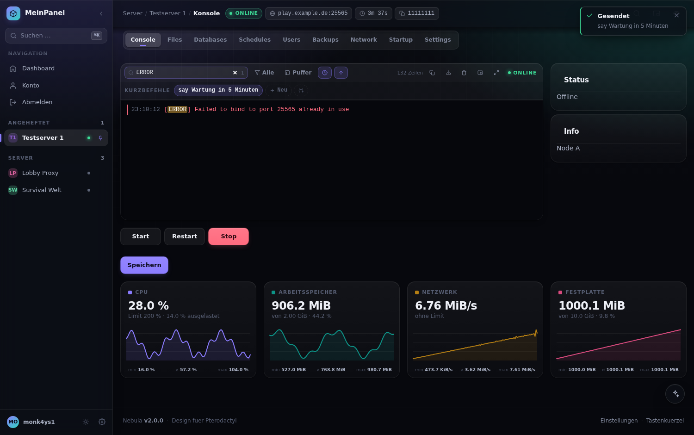
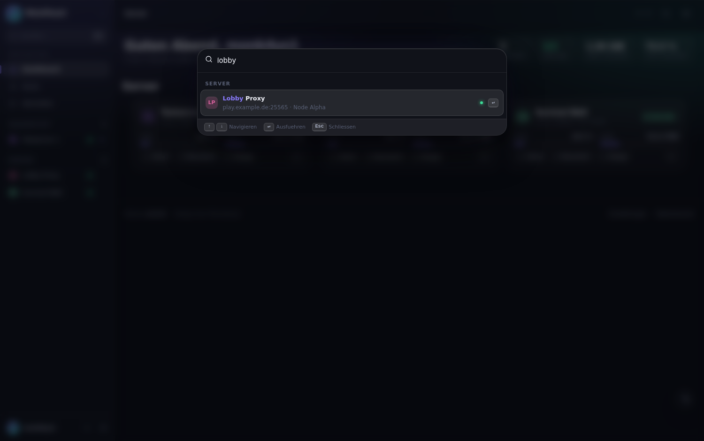
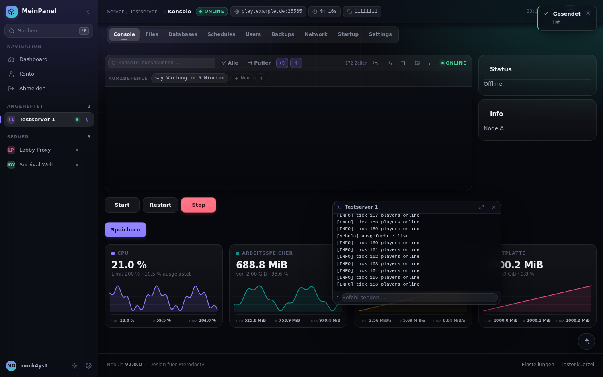
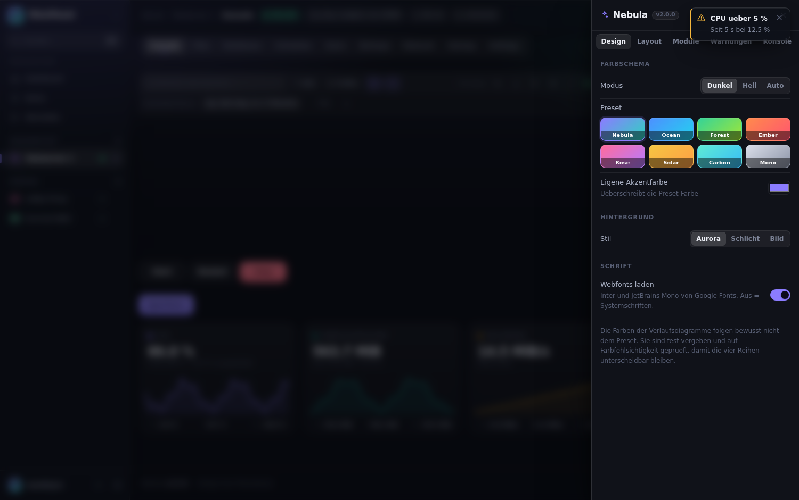
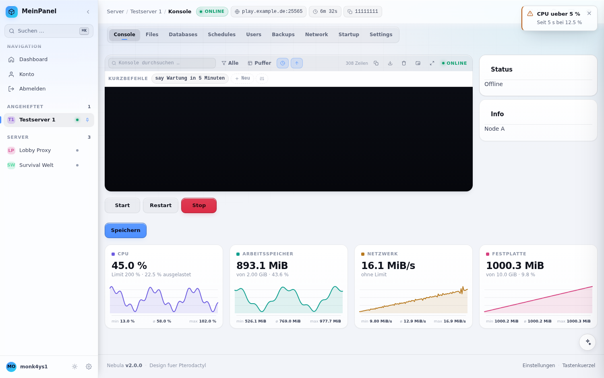
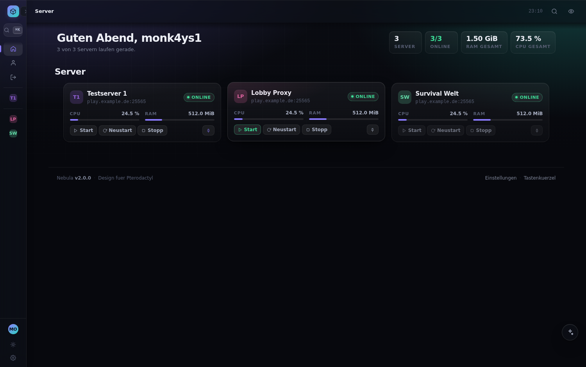
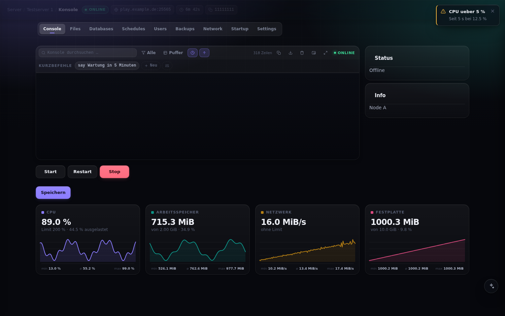
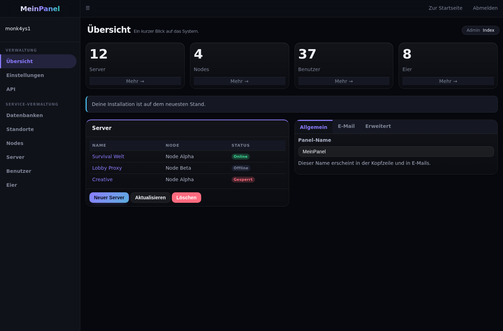
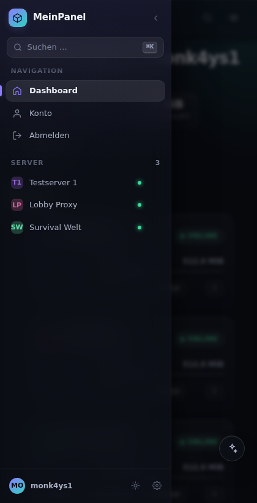

<div align="center">

# Nebula

**Ein vollständiges Redesign für das Pterodactyl Panel – mit einem einzigen Befehl installiert.**

Seitenschiene statt Kopfleiste, Serverübersicht mit Live-Auslastung, Befehlspalette,
Verlaufsdiagramme mit Fadenkreuz, Konsolen-Werkzeuge, frei belegbare Kurzbefehle,
schwebende Mini-Konsole, Warnregeln — und acht Farbpresets samt Hellmodus.

Ohne Rebuild des Frontends. Jederzeit rückstandslos entfernbar.

</div>

---

## Installation

```bash
bash <(curl -fsSL https://raw.githubusercontent.com/Monk4ys1/pterodactyl-design/HEAD/install.sh)
```

Das war's. Der Installer findet dein Panel selbst, legt vorher ein Backup an und
sagt dir am Ende, was du drücken kannst.

> Falls `curl` fehlt: `apt install curl` bzw. `dnf install curl`.
> Der Befehl muss als `root` laufen (oder mit `sudo bash <(...)`).

> **Solange dieses Repository privat ist**, kann `curl` die Datei nicht ohne
> Zugangsdaten laden. Dann entweder das Repository öffentlich schalten – danach
> funktioniert der Ein-Zeiler unverändert – oder einmalig klonen:
>
> ```bash
> git clone https://github.com/Monk4ys1/pterodactyl-design.git
> sudo bash pterodactyl-design/install.sh
> ```
>
> Der Installer erkennt, dass er aus einem lokalen Verzeichnis läuft, und lädt
> dann nichts nach.

Danach im Browser einmal mit <kbd>Strg</kbd>+<kbd>F5</kbd> neu laden.

### Wieder entfernen

```bash
nebula uninstall
```

Das Panel ist danach **byte-identisch** im Originalzustand – die Blade-Templates
werden exakt so wiederhergestellt, wie sie vorher waren.

---

## Screenshots

| Anmeldung | Übersicht mit Live-Auslastung |
|---|---|
|  |  |

| Serverkonsole mit Verlaufsdiagrammen | Konsolensuche |
|---|---|
|  |  |

| Befehlspalette | Mini-Konsole |
|---|---|
|  |  |

| Einstellungen | Hellmodus |
|---|---|
|  |  |

| Schmale Schiene | Fokusmodus |
|---|---|
|  |  |

| Adminbereich | Mobil |
|---|---|
|  |  |

<sub>Die Bilder stammen aus der automatisierten Testumgebung unter `tests/`, die
Markup, Farbwerte und den Wings-Datenstrom des Panels nachbildet.</sub>

---

## Die Oberfläche

### Seitenschiene

Die Kopfleiste des Panels weicht einer Schiene am linken Rand. Sie zeigt
Navigation, alle Server mit Live-Status, angeheftete Favoriten und den
Kontobereich. Zwei Breiten (<kbd>Strg</kbd>+<kbd>B</kbd>), auf schmalen
Bildschirmen fährt sie über einen Menüknopf ein.

**Die Navigationseinträge werden gespiegelt, nicht nachgebaut.** Was Pterodactyl
dort rendert – auch künftige Einträge – erscheint automatisch in der Schiene. Die
Originalleiste wird nur ausgeblendet, nie entfernt.

### Kopfleiste

Pfadanzeige (Server → Name → Reiter), Serverstatus, Adresse und UUID zum Kopieren,
Laufzeit, Uhr, Suche, Mini-Konsole und Fokusmodus.

### Material und Typografie

Flächen entstehen aus Verlauf plus Rahmenlicht statt aus einer flachen Füllfarbe.
Navigation, Meldungen und Overlays sind durchscheinende Ebenen, unter denen der
Inhalt hindurchläuft. Die Typoskala setzt Laufweite und Zeilenhöhe
**größenabhängig** – große Schrift enger und dichter, kleine Schrift weiter.
Zahlen laufen durchgehend auf Tabellenziffern, damit Messwerte nicht springen.

Rückmeldung liegt auf dem Druck, nicht auf dem Loslassen. Die Bewegungskurven
bilden kritisch gedämpfte Federn nach; Überschwingen bleibt den Bewegungen
vorbehalten, denen eine Geste vorausging (das Ziehen der Mini-Konsole).

---

## Funktionen

| Funktion | Beschreibung |
|---|---|
| **Serverübersicht** | Kacheln mit Live-Auslastung von CPU und RAM, Statusanzeige und Schnellsteuerung (Start / Neustart / Stopp), ohne den Server zu öffnen. Darüber Kennzahlen über alle Server. |
| **Befehlspalette** | <kbd>Strg</kbd>+<kbd>K</kbd>: Server suchen, Seiten wechseln, Server steuern, Kurzbefehle senden, Preset umschalten – mit Treffer-Hervorhebung, Statuspunkten und „zuletzt besucht“. |
| **Verlaufsdiagramme** | CPU, Arbeitsspeicher, Netzwerk, Festplatte. Mit zurücktretendem Raster, Fadenkreuz und Sprechblase beim Überfahren, Min/ø/Max und CSV-Export. |
| **Konsolen-Werkzeuge** | Volltextsuche mit Hervorhebung, Filter nach Fehlern/Warnungen, Zeitstempel, Zeilenzähler, Kopieren, Download als `.log`, Vollbild. |
| **Kurzbefehle** | Frei belegbare Befehle je Server als Chip-Leiste unter der Werkzeugleiste. Ein Klick sendet sie über die bereits bestehende Konsolenverbindung. |
| **Mini-Konsole** | Schwebendes Fenster, das sichtbar bleibt, während du in Dateien, Backups oder Einstellungen arbeitest. Frei verschiebbar und in der Größe änderbar, mit eigener Eingabezeile. |
| **Fokusmodus** | Schiene und Kopfleiste treten zurück, die Konsole bekommt den ganzen Platz. |
| **Anheften & Markieren** | Server anheften, damit sie oben stehen. Farbe und Kürzel je Server vergeben – sichtbar in Schiene, Kacheln und Palette. |
| **Schlüsselwort-Wächter** | Begriffe festlegen, die in der Konsole beobachtet werden (Text oder `/muster/i`). Bei einem Treffer gibt es Meldung, optional Desktop-Hinweis und Ton. |
| **Auslastungswarnungen** | Schwellen für CPU und RAM mit Haltezeit – gewarnt wird erst, wenn der Wert länger über der Schwelle liegt, nicht bei einzelnen Spitzen. Entwarnung inklusive. |
| **Statusmeldungen** | Toast bei jedem Statuswechsel, Statuspunkt im Favicon, Symbol im Seitentitel, Absturzerkennung im Konsolenstrom. |
| **Adminbereich** | Vollständig überarbeitet – Seitenleiste, Boxen, Reiter, Tabellen, Formulare, Select2, CodeMirror. |

Jede Funktion lässt sich einzeln abschalten – auch die Seitenschiene selbst; dann
bleibt die Kopfleiste des Panels erhalten und wird nur eingefärbt.

### Aussehen einstellen

Acht Presets (Nebula, Ocean, Forest, Ember, Rose, Solar, Carbon, Mono), freie
Akzentfarbe, Hell-/Dunkel-/Automatikmodus, Eckenradius, Glasstärke, kompakte
Ansicht, breites Layout (bis 1720 px), Animationen, Hintergrund
(Aurora / schlicht / eigenes Bild).

Das Terminal bleibt im Hellmodus bewusst dunkel: xterm.js zeichnet seine
Vordergrundfarben auf ein Canvas und lässt sich per CSS nicht umfärben – ein
helles Terminal wäre unlesbar.

Die Farben der Verlaufsdiagramme folgen bewusst **nicht** dem Preset. Sie sind
fest vergeben und mit einem Validator auf Helligkeitsband, Chroma-Untergrenze,
Kontrast und Farbfehlsichtigkeit (Protan/Deutan/Tritan) geprüft, damit die vier
Reihen unterscheidbar bleiben.

### Tastenkürzel

| Kürzel | Aktion |
|---|---|
| <kbd>Strg</kbd>+<kbd>K</kbd> | Befehlspalette |
| <kbd>Strg</kbd>+<kbd>/</kbd> | Übersicht der Tastenkürzel |
| <kbd>Strg</kbd>+<kbd>B</kbd> | Schiene ein-/ausklappen |
| <kbd>Strg</kbd>+<kbd>Umschalt</kbd>+<kbd>E</kbd> | Einstellungen |
| <kbd>Strg</kbd>+<kbd>Umschalt</kbd>+<kbd>L</kbd> | Hell / Dunkel |
| <kbd>Strg</kbd>+<kbd>Umschalt</kbd>+<kbd>F</kbd> | Konsole im Vollbild |
| <kbd>Strg</kbd>+<kbd>Umschalt</kbd>+<kbd>D</kbd> | Mini-Konsole |
| <kbd>Strg</kbd>+<kbd>Umschalt</kbd>+<kbd>Z</kbd> | Fokusmodus |
| <kbd>g</kbd> dann <kbd>d</kbd>/<kbd>c</kbd>/<kbd>f</kbd>/<kbd>b</kbd>/<kbd>n</kbd>/<kbd>u</kbd>/<kbd>t</kbd>/<kbd>s</kbd>/<kbd>a</kbd> | Dashboard, Konsole, Dateien, Backups, Netzwerk, Benutzer, Zeitpläne, Servereinstellungen, Konto |
| <kbd>Alt</kbd>+<kbd>S</kbd> / <kbd>R</kbd> / <kbd>X</kbd> / <kbd>K</kbd> | Starten, Neustart, Stoppen, Kill |
| <kbd>Alt</kbd>+<kbd>1</kbd> … <kbd>9</kbd> | Reiter der Sub-Navigation |
| <kbd>Esc</kbd> | Oberstes Overlay schließen |

Sprungbefehle und Power-Kürzel greifen nur außerhalb von Eingabefeldern und
außerhalb des Terminals.

---

## Kompatibilität

| | |
|---|---|
| **Panel** | Pterodactyl 1.11.x (getestet gegen 1.11.7 – 1.11.10) und 1.10.x |
| **PHP** | ≥ 8.1 – das Theme selbst führt keinen PHP-Code aus |
| **Browser** | Chrome/Edge 111+, Firefox 113+, Safari 16.4+ (`color-mix()` wird benötigt) |
| **Rebuild** | **nicht nötig** – `yarn build:production` bleibt außen vor |
| **Datenbank** | wird nicht angefasst |

Bei einer unbekannten Panel-Version installiert Nebula trotzdem, warnt aber
vorher. Da alles reversibel ist, kostet ein Versuch nichts.

---

## Befehle

Der Installer legt den Befehl `nebula` an:

```bash
nebula update      # Theme neu bauen und einspielen (auch nach Panel-Updates)
nebula uninstall   # Vollständig entfernen
nebula doctor      # Installation prüfen
nebula status      # Version, Asset-Version, Installationszeitpunkt, Backup
nebula restore     # Letztes Backup zurückspielen
```

Der Installer selbst kennt zusätzlich:

```bash
--path <verzeichnis>   Pfad zum Panel (sonst automatisch erkannt)
--branch <name>        Anderer Git-Ref als Quelle (Branch, Tag oder Commit)
--yes                  Ohne Rückfragen
--no-backup            Kein Backup (nicht empfohlen)
--no-admin             Adminbereich unverändert lassen
--no-cli               Den Befehl "nebula" nicht anlegen
--dry-run              Nur anzeigen, was passieren würde
```

### Nach einem Panel-Update

Ein Panel-Update überschreibt `resources/views/templates/wrapper.blade.php` und
entfernt damit den Nebula-Block. Einmal

```bash
nebula update
```

und alles ist wieder da. `nebula doctor` weist von sich aus darauf hin, wenn sich
die Panel-Version seit der Installation geändert hat.

---

## Wie es funktioniert

Pterodactyls Client-Oberfläche ist eine React-Anwendung, deren Klassennamen beim
Build gehasht werden. Ein Theme, das sich darauf verlässt, ist beim nächsten
Panel-Update kaputt. Nebula geht deshalb einen anderen Weg:

```
resources/views/templates/wrapper.blade.php   ← ein Block zwischen Markern
resources/views/layouts/admin.blade.php       ← ein Block zwischen Markern
public/themes/nebula/                         ← nebula.css / nebula.js
```

1. **`nebula.js` startet im `<head>`**, also noch vor dem React-Bundle.
2. Ein **DOM-Tagger** (`MutationObserver`) versieht die gerenderten Elemente mit
   stabilen `data-ptd`-Attributen – Navigation, Reiter, Karten, Konsole, Modals,
   Serverzeilen. Das CSS stylt diese Attribute statt der gehashten Klassen.
   Button-Varianten werden über die Tailwind-Klasse bzw. den Farbton der
   berechneten Hintergrundfarbe erkannt.
3. Zusätzlich werden die **Tailwind-Farbklassen** von Pterodactyl
   (`bg-neutral-700`, `text-neutral-400`, `bg-primary-500` …) auf
   CSS-Custom-Properties umgebogen. Dadurch färbt sich auch alles um, was der
   Tagger gar nicht kennt.
4. `window.WebSocket` wird **transparent gekapselt**, um den Wings-Datenstrom
   mitzulesen (`console output`, `stats`, `status`). Daraus entstehen Diagramme,
   Konsolensuche, Mini-Konsole und Warnregeln – **ohne eine einzige zusätzliche
   Anfrage** an Panel oder Node. Kurzbefehle gehen über genau dieselbe Verbindung
   hinaus; es wird keine zweite geöffnet.
5. Die Ressourcen-Abfragen, die das Dashboard für seine eigenen Zeilen ohnehin
   ausführt, werden ebenfalls nur mitgehört. Nur wenn davon nichts ankommt, fragt
   die Übersicht selbst nach – und dann bewusst sparsam.

Alle Einstellungen liegen im `localStorage` des Browsers (`ptd:settings`), sind
also **pro Benutzer und Gerät** und ändern nichts am Panel.

### Sicherheit und Rücksprung

- Vor jeder Installation wandert alles Betroffene nach
  `/var/backups/nebula/<zeitstempel>.tar.gz` (Modus `600`).
- Der eingefügte Blade-Block steht zwischen `{{-- NEBULA:START --}}` und
  `{{-- NEBULA:END --}}` und wird beim Entfernen sauber herausgeschnitten.
- Dateien werden über `cat tmp > datei` geschrieben, damit Besitzer, Rechte und
  SELinux-Kontext erhalten bleiben.
- Es wird ausschließlich `php artisan view:clear` ausgeführt – nur der
  View-Cache, keine Config- oder Route-Caches.
- Jeder JavaScript-Baustein ist in `try/catch` gekapselt; ein Fehler im Theme
  darf den Panelbetrieb nicht stören.

### Barrierefreiheit

`prefers-reduced-motion` ersetzt Bewegung durch Überblendungen,
`prefers-reduced-transparency` macht Material deckend,
`prefers-contrast: more` verstärkt Ränder und Textkontrast. Der Statuszustand
steht nie nur in der Farbe: Punkte tragen immer eine Beschriftung daneben.

---

## Entwicklung

```
theme/css/     Tokens, Basis, Shell, Komponenten, Konsole, Login, eigene UI, Diagramme, Übersicht, Admin
theme/js/      Boot, Core, Tagger, Schiene, Einstellungen, Palette, Konsole,
               Diagramme, Übersicht, Meldungen, Kürzel, Markierungen, Ergänzungen
theme/blade/   Die eingefügten Blade-Blöcke
scripts/       build.sh – fasst die Quellen zu den Bundles zusammen
tests/         Nachbau der Panel-Oberfläche + Browsertests
install.sh     Installer, Updater, Deinstaller, Diagnose
```

Bundles bauen:

```bash
bash scripts/build.sh dist
```

Ergebnis: `nebula.css`, `nebula.js` (Client) sowie `nebula-admin.css`,
`nebula-admin.js` (Admin).

Testen (startet einen Nachbau der Panel-Oberfläche samt Wings-WebSocket und
prüft ihn in einem echten Chromium):

```bash
bash tests/run.sh
```

Die Suite prüft rund 70 Punkte – von der Erkennung der Login-Karte über den
WebSocket-Mitschnitt, das Ziehen der Mini-Konsole und das tatsächliche Absenden
eines Kurzbefehls bis zum mobilen Layout – und legt Screenshots unter
`tests/shots/` ab.

Lokal installieren, ohne etwas herunterzuladen:

```bash
sudo bash install.sh --path /var/www/pterodactyl --yes
```

---

## Fehlersuche

**Nach der Installation sieht alles aus wie vorher.**
Browser-Cache leeren (<kbd>Strg</kbd>+<kbd>F5</kbd>). Wenn es bleibt:
`nebula doctor`.

**`nebula doctor` meldet fehlende Assets.**
`nebula update` spielt sie neu ein.

**Das Panel zeigt eine weiße Seite.**
`nebula uninstall` – oder direkt `nebula restore`. Beides stellt den
Ausgangszustand wieder her.

**Die Diagramme bleiben leer.**
Sie zeigen nur laufende Server. Ist der Server online und die Konsole verbunden,
füllen sich die Kurven innerhalb weniger Sekunden.

**Kurzbefehle werden nicht gesendet.**
Sie laufen über die Konsolenverbindung. Diese muss offen sein – also der Server
mindestens einmal in dieser Sitzung im Konsolen-Reiter geöffnet worden sein.

**Die Schrift lädt nicht (Panel ohne Internetzugang).**
Im Einstellungsbereich unter *Design → Schrift* die Webfonts abschalten. Nebula
fällt dann auf die Systemschriften zurück; das Layout bleibt gleich.

**Der Installer findet das Panel nicht.**
`sudo bash install.sh --path /pfad/zum/panel`.

---

## Lizenz

MIT – siehe [LICENSE](LICENSE).

Nebula ist ein eigenständiges Projekt und steht in keiner Verbindung zum
Pterodactyl-Projekt.
